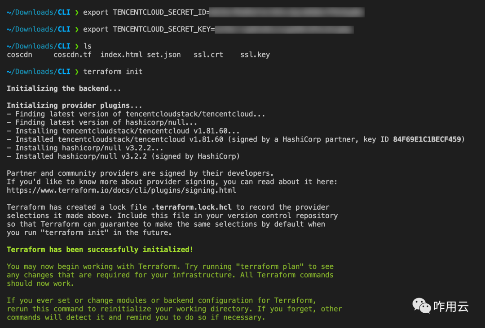
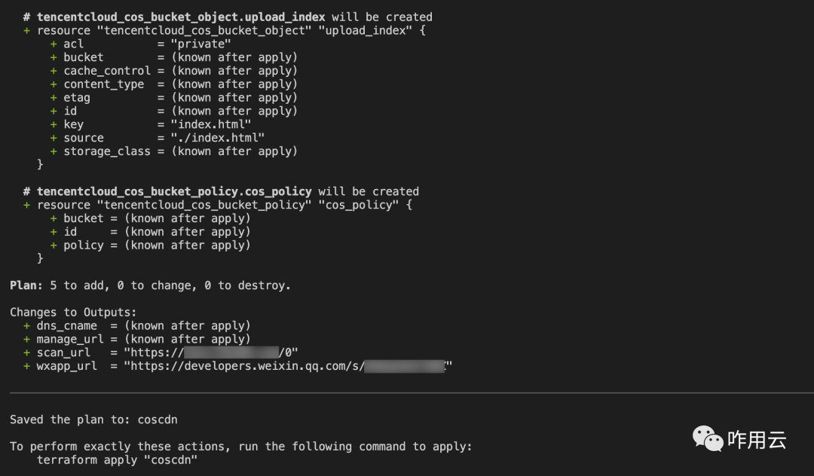
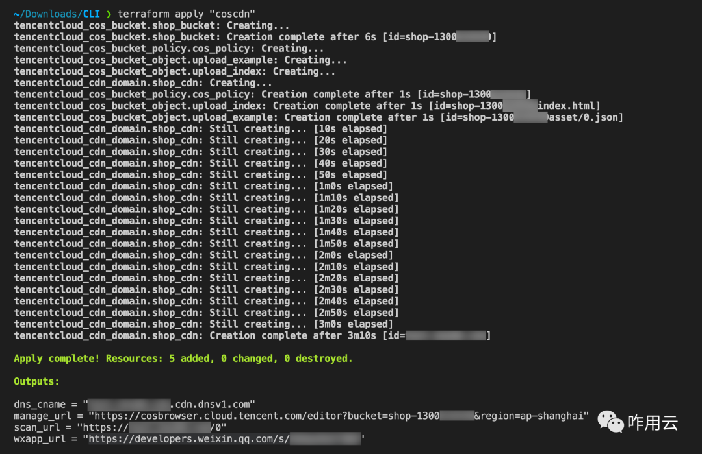
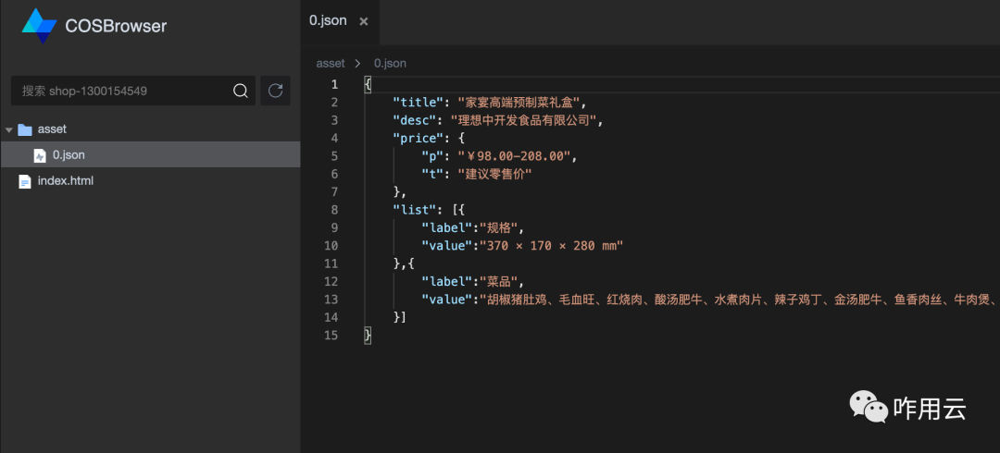
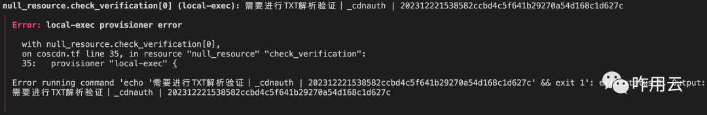
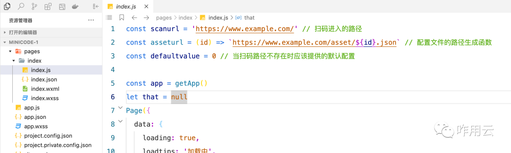
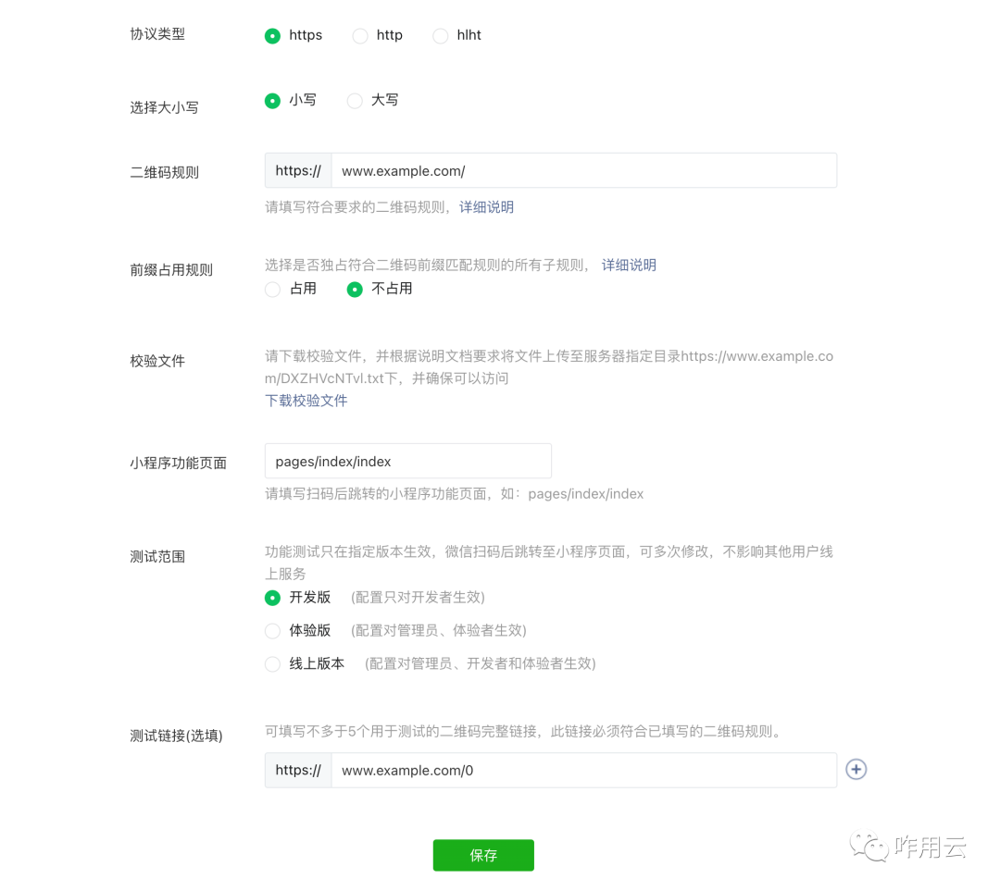
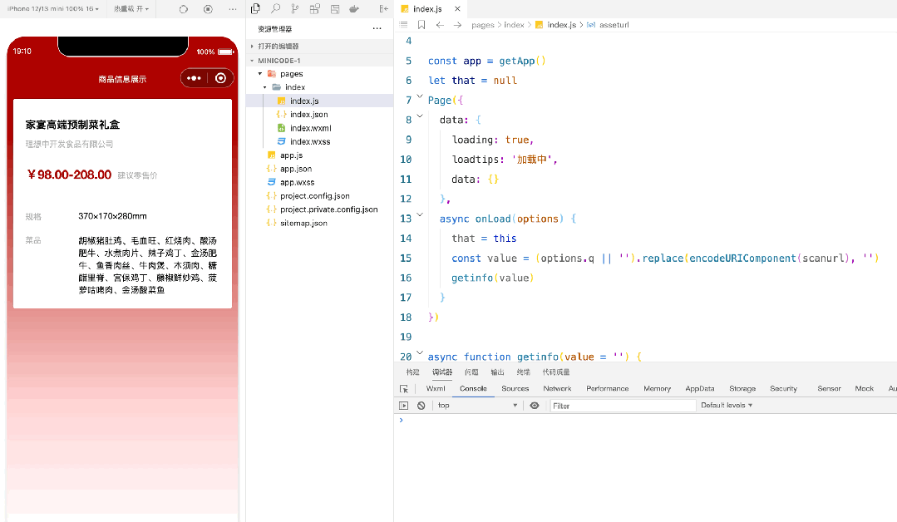

<h2 align="center">

9.9 元的服务器太贵，继续降本十倍

</h2>

- [公众号文章链接](https://mp.weixin.qq.com/s/-P3AV3R6w_JZINONzu0mkA)

在目录中运行终端，执行 init 命令，安装 provider plugins

```bash
terraform init
```



完成后，运行 plan 命令查看执行计划

```bash
terraform plan -out="coscdn" // 将计划导出到执行目录中，文件名coscdn
```

我们可以清晰的在计划中看到我们要做什么，新增、更新、移除资源的数量，以及拟输出的内容等等。



确认执行的内容后，我们可以用 apply 来执行

```bash
terraform apply "coscdn" // 这里的 coscdn 是 plan 时保存的
```

执行过程包含，开通对象存储桶，配置 policy，上传 2 个测试文件，开通 CDN 共 5 个部分



最后输出了几个内容（这些内容都是 tf 中定义的，后面其他案例会不一样，每个案例都会描述这一部分）：

1. **dns_cname：** 自定义域名应该 cname 解析的值，由于自定义域名可能来自不同的服务商，因此没有直接写到`tf`中，需要手动配置这个部分，如果你的域名也在腾讯云上，可以直接加配置解析这一部分。
2. **manage_url：** 可以访问该地址，登录腾讯云账号来管理对象存储的内容。



3. **scan_url：** 根据自定义域名做的二维码解析，以域名+商品 ID 的形式出现。由于在对象存储中配置了 error 页均为 index.html，因此除了 asset 下信息文件路径正常返回内容外，其余的所有路径均返回 index.html。这个是开发设计如此，你可以根据自己需要更改这一部分。
4. **wxapp_url：** 这个是`微信小程序代码片段链接`，复制到浏览器打开后，会引导你安装或打开微信开发者工具 IDE，里面有相关的代码，接下来我们重点介绍这一部分。

> 如果在执行过程中报出了下述错误，需要先做域名 TXT 解析验证，验证域名所有权归属于你。
>
> 

## 微信小程序开发调试

微信小程序的调试开发比较简单，使用代码片段导入后，打开 page/index/index.js 文件，将前 3 行代码做一些调整，改为自己的域名。



另外`微信小程序扫普通二维码配置`需要前往微信公众平台（mp.weixin.qq.com），在 `开发配置` 中按照规范配置内容：



在`微信开发者工具IDE`中，可以通过配置参数 `q=https%3A%2F%2Fwww.example.com%2F0` 来模拟扫码 `https://www.example.com/0` 进入小程序。(URL 需要通过`encodeURIComponent`方法处理)

运行效果如下：

