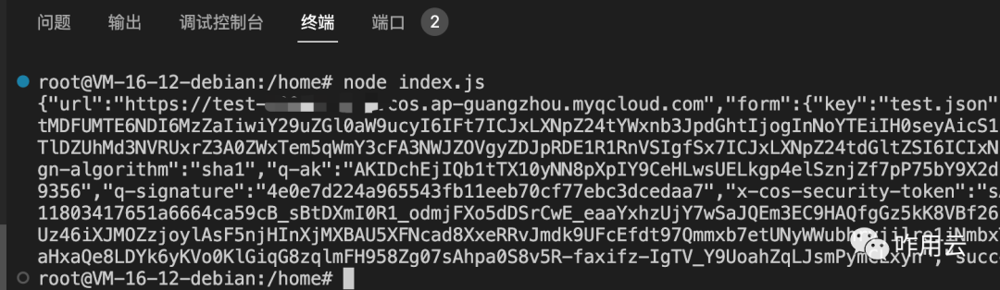
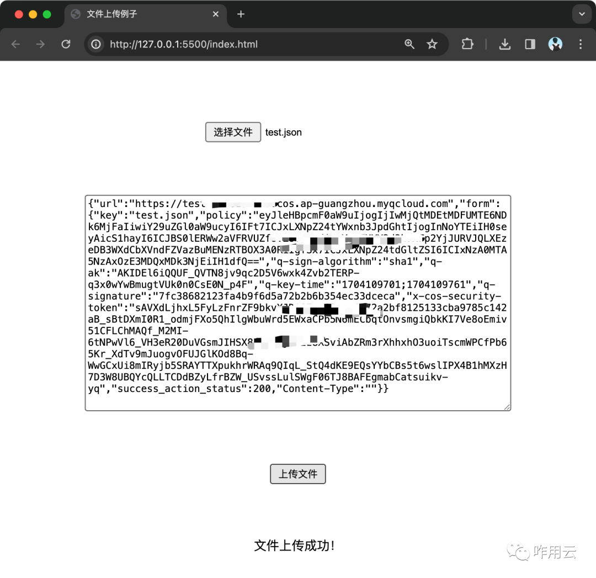

<h2 align="center">

对象存储私有读写方案实现｜云原生实践

</h2>

- [公众号文章链接](https://mp.weixin.qq.com/s/u59tJvtJI9S1Z16NrpFXlA)

在本文的案例中，我们使用`云服务器`来做上传下载的预签名，我们希望`云服务器`可以有权操作`对象存储某个存储桶`的**文件读写**。

因此我们就可以在`访问管理`中创建一个角色，并授予角色对应的对象存储桶访问策略。然后对云服务实例绑定这个角色。

腾讯云内实现上述过程的terraform文件[链接](./example.tf)

接下来在云服务器中运行的应用程序，可以通过访问`实例元数据地址`，来获取绑定角色的`临时密钥`。

腾讯云服务器中获取`cos_rw_role`角色的临时访问密钥，NodeJS 代码[链接](./metadata.js)

我们解决了访问密钥问题，接下来我们就可以遵循各家的云文档来进一步实现了。直接使用 SDK，并将密钥初始化部分替换成资源角色的临时密钥，很容易就能实现整个过程。

在这里我给出在腾讯云上，**不使用 SDK** 实现获取预授权链接：

在腾讯云服务器中，创建 [index.js 文件](./presign/index.js)

服务器中运行下列命令：

``` bash
# 安装nodejs步骤
apt-get update
curl -sL https://deb.nodesource.com/setup_18.x | sudo -E bash -
apt-get install nodejs -y
# 运行index.js文件
node index.js
```

效果图如下：



这里直接字符串化了，方便我们直接复制测试，真实使用时还需要自己改一下。

然后我们创建一个 [index.html 文件](./presign/index.html)

开启本地 live 服务器，访问 html 文件，选择文件并填入内容

需要注意在对象存储桶中需要设置CORS加本地域。


